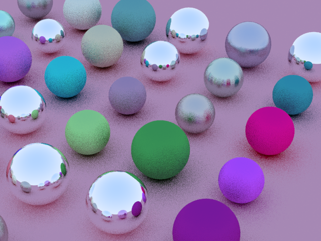

# CPU raytracer
### Description
----
This is a personal project that I developed as a way to learn more about computer graphics and rendering using Python. The raytracer is designed to simulate the behavior of light in a virtual environment, allowing us to generate photorealistic images with a high degree of realism and detail.

Despite being a personal project, this raytracer is not just an entry-level implementation. It has been designed with a focus on optimization, using parallel processing techniques to improve performance and minimize rendering times. Additionally, it features advanced rendering techniques such as anti-aliasing, reflection, refraction, and more.

In this repository, you will find the source code for the raytracer, along with a sample scenes. You can also find some sample image generated by the raytracer to get a sense of what it is capable of.

Output: png-file render with random scene. 
#### Requirements
----
1. numpy
2. matplotlib

#### Output example
----

----

Thanks
[_Ray Tracing in One Weekend_](https://raytracing.github.io/books/RayTracingInOneWeekend.html) for reference materials.
